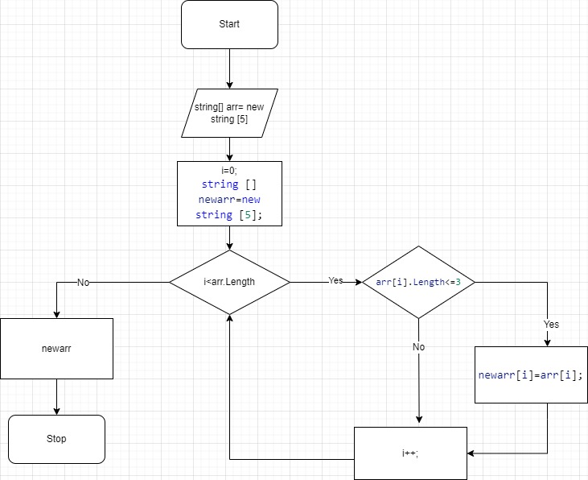

# Instruction how create new array
## Task
 Написать программу, которая из имеющегося массива строк формирует новый массив из строк, длина которых меньше, либо равна 3 символам. Первоначальный массив можно ввести с клавиатуры, либо задать на старте выполнения алгоритма. При решении не рекомендуется пользоваться коллекциями, лучше обойтись исключительно массивами.
### First step to do this task
1. Create diagram

2.According to diagram, create necessary method 
``` 
string [] RecreateArr (string []arr)
```
### Second step to do this task
1.Ask user to input symbols/text/numbers, creating new method
```
string [] ReadData(string line)
```
2. Read it in array
```
arr[i]=Console.ReadLine();
```
3. Print it, creating new method
```
void PrintData(string []newarr)
```
### Third step to do this task
Don't forget all your changes to add in Github:
1. Create **local repository**
2. Create **remote repository**
3. Save all your changes in VS
4. Create file **.gitignore**
5. Add remote repository
6. **Add** all your files
7. **Commit** it
8. **Push** it

